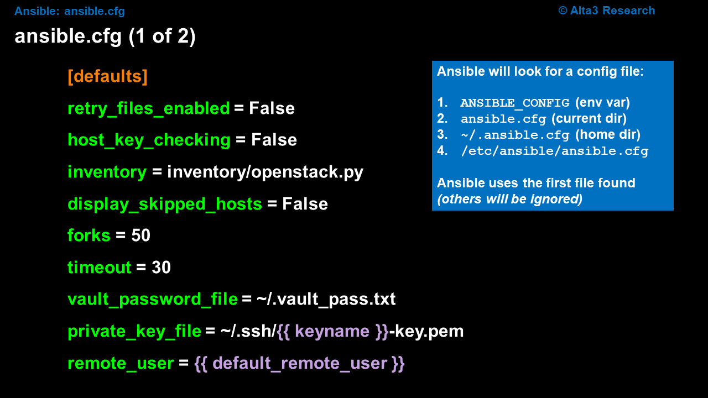

# ansible.cfg Setup

Configure Ansible with a config file to reduce the dependency on cli arguments. The Ansible configuration file primarily effects the Ansible Controller, therefore, it is applicable regardless of the platform being connected to; Linux, Windows, Storage, Cloud, etc.




Before ansible runs, it will read the `ansible.cfg` file. In this file, we can place global configuration settings, that allow us to "type less" when executing an Ansible playbook. This file also can help us leverage how Ansible runs.

The file `ansible.cfg` will be searched for in the following order. If a file is found, Ansible will ignore any remaining sources:

* The environmental variable ANSIBLE_CONFIG (environment variable if set)
* The file ansible.cfg (in the current directory)
* ~/.ansible.cfg (in the home directory)
* /etc/ansible/ansible.cfg (last location checked)

**If you do not have an `~/.ansible.cfg` file, then running a playbook without the inventory flag, will cause a failure**. The inventory flag is the `-i` flag. *Note: Flags passed at the CLI always win precedence*. Rather than utilize the `-i` flag, let's write that information into a file called, `ansible.cfg`. This file contains default values that control how Ansible runs. It can live in a number of locations. Local to the playbook, within your home directory, or in, `/etc/ansible/`. Let's put ours in the home directory. The only caveat is that we need to make it a hidden file (put a dot before the name of the file).

File `~/.ansible.cfg`:
```ini
[defaults]
# default location of inventory
# this can be a file or a directory
inventory = /home/student/mycode/inv/dev/

# prevents playbook from hanging on new connections
host_key_checking = False
```

To see defaults Ansible currently has set
```bash
ansible-config dump
```

If you want to generate a "complete" ansible.cfg file to examine, you can do so with the following command.
```bash
ansible-config init --disabled -t all > ansible-example.cfg
```


