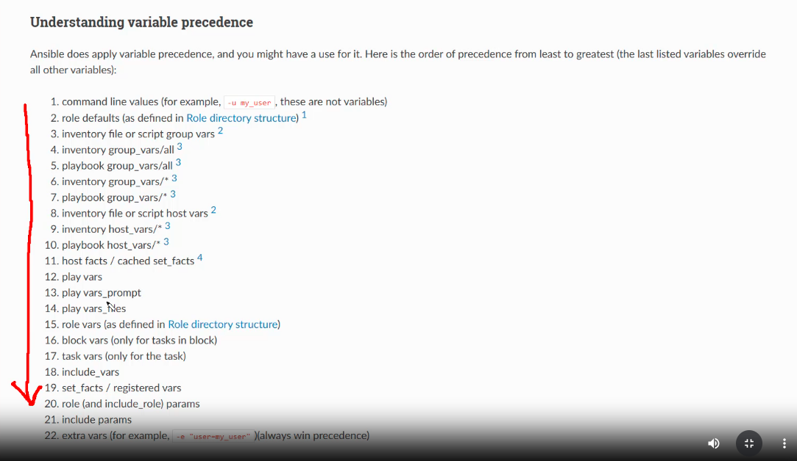

# Basic Variable Methods in Ansible (vars, vars_files, host vars, -e)

### What is a variable?
A variable in Ansible is a way to store and reuse data. Instead of hardcoding values into your playbooks, you define variables that can change based on the environment, host, or context. This makes playbooks more flexible and easier to manage.

Variables can be defined in multiple locations, each with a different priority. Let’s break them down:



### Define variables in the inventory file:
Start with the lowest precedence by defining variables in the inventory file. Remove your original inventory file and open a new one:

File `~/mycode/inv/dev/hosts`:

```ini
bender ansible_host=10.10.2.3 ansible_user=bender dino_name=Triceratops dino_food="ferns" dino_direction="to your left"
```

Create a playbook that uses these variables to simulate a Jurassic Park jeep tour
```bash
vim ~/jurassic_tour.yaml
```

```yaml
- hosts: bender
  tasks:
    - name: Announce the dinosaur
      shell: |
        echo "Our next stop will take us past the {{ dino_name }}. It loves eating {{ dino_food }}.
        You should be able to see it if you look {{ dino_direction }}" >> /tmp/jurassicpark.txt
```

### Add a play variable
Let’s override the host variables with play-level variables. Edit the playbook:

```yaml
- hosts: bender
  vars:
    dino_name: Velociraptor  # Overrides host variable
    dino_food: "small mammals and lizards"
    dino_direction: "to your right"
  tasks:
    - name: Announce the dinosaur
      shell: |
        echo "Our next stop will take us past the {{ dino_name }}. It loves eating {{ dino_food }}.
        You should be able to see it if you look {{ dino_direction }}" >> /tmp/jurassicpark.txt
```

### Add a variables file
Create a file to define the variables:

```bash
vim ~/mycode/vars/dino_vars.yml
```

```ini
dino_name: Stegosaurus
dino_food: "ferns and mosses"
dino_direction: "to your left"
```

```yaml
- hosts: bender
  vars_files:
    - ~/mycode/vars/dino_vars.yml # Overrides playbook variables
  vars:
    dino_name: Velociraptor  # Overrides host variable
    dino_food: "small mammals and lizards"
    dino_direction: "to your right"
  tasks:
    - name: Announce the dinosaur
      shell: |
        echo "Our next stop will take us past the {{ dino_name }}. It loves eating {{ dino_food }}.
        You should be able to see it if you look {{ dino_direction }}" >> /tmp/jurassicpark.txt
```

### Add a task variable
Let’s override the play variables with task-level variables. Edit the playbook:
```yaml
- hosts: bender
  vars:
    dino_name: Velociraptor  # Overrides host variable
    dino_food: "small mammals and lizards"
    dino_direction: "to your right"
  tasks:
    - name: Announce the dinosaur
      shell: |
        echo "Our next stop will take us past the {{ dino_name }}. It loves eating {{ dino_food }}.
        You should be able to see it if you look {{ dino_direction }}" >> /tmp/jurassicpark.txt
      vars:
        dino_name: Brachiosaurus  # Overrides play variable
        dino_food: "leaves from tall trees"
        dino_direction: "to your right above the tree line"
```


### Override with Extra Vars (`-e`)
Extra vars have the highest precedence. Run the playbook with extra variables, which should override every variable that we've set so far:

```bash
ansible-playbook ~/jurassic_tour.yaml -e "dino_name='T-Rex' dino_food='slow Jurassic Park visitors' dino_direction='OH NO IT\'S BEHIND US EVERYONE RUN'"
```

