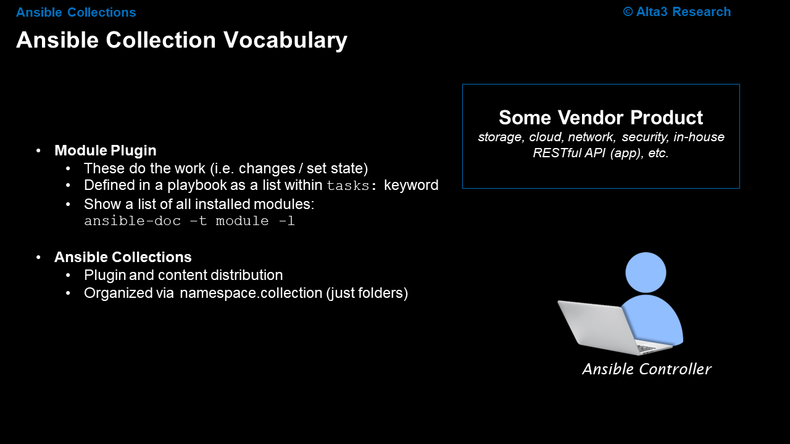
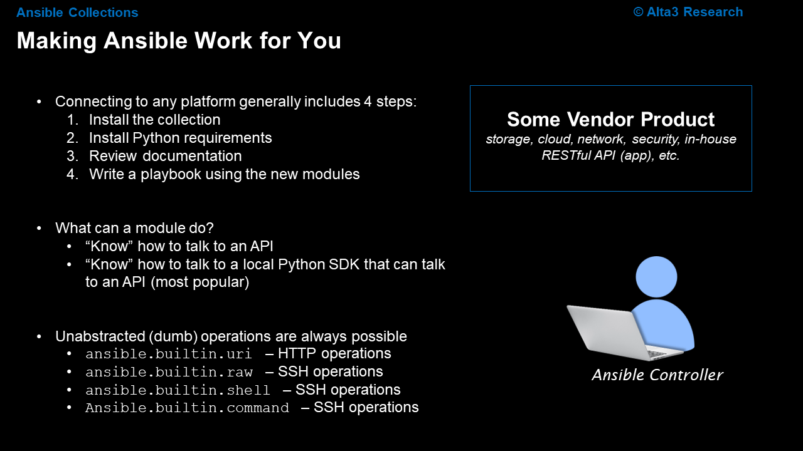
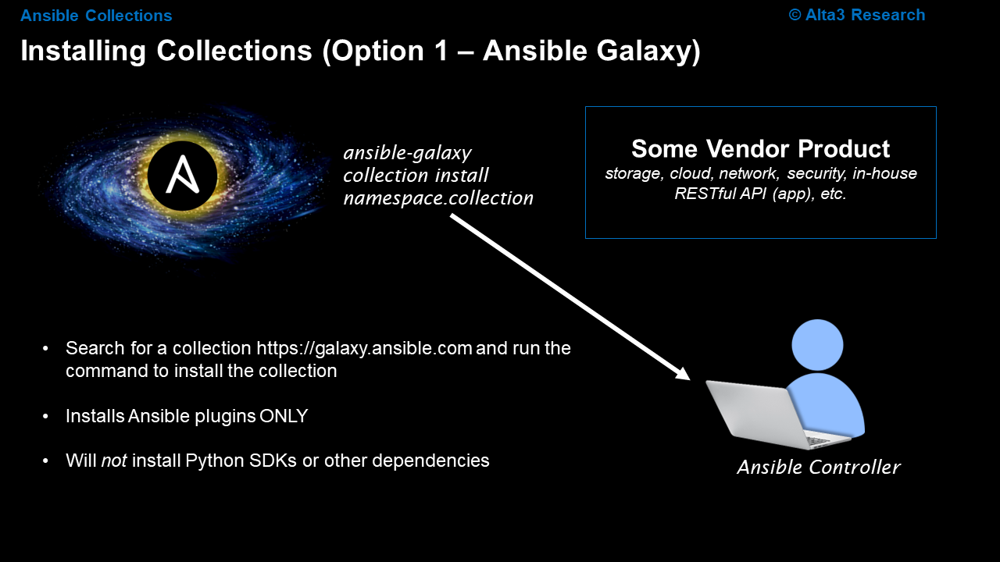
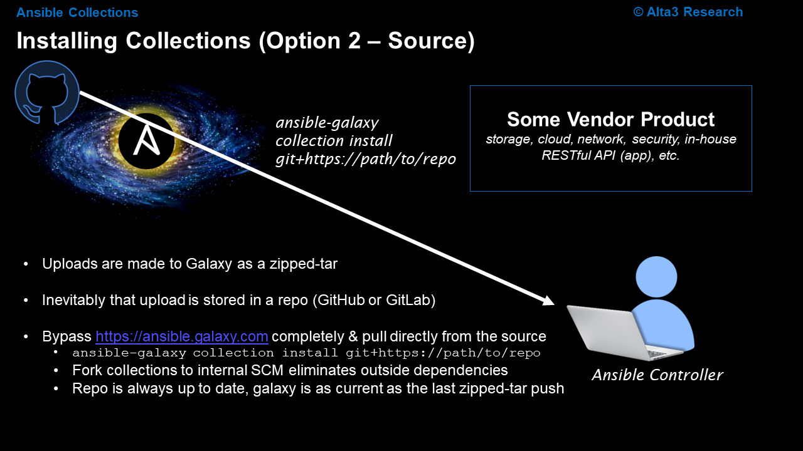
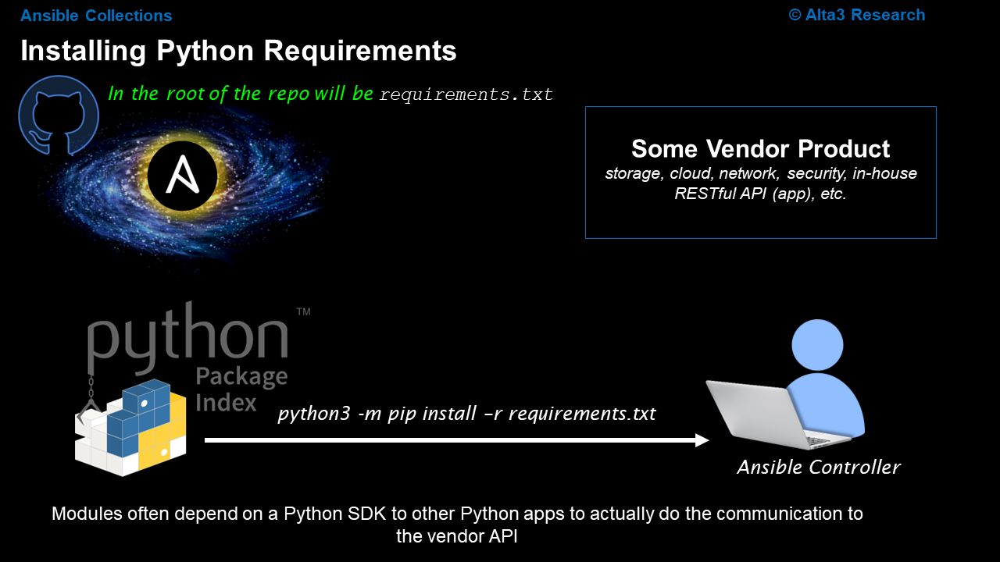
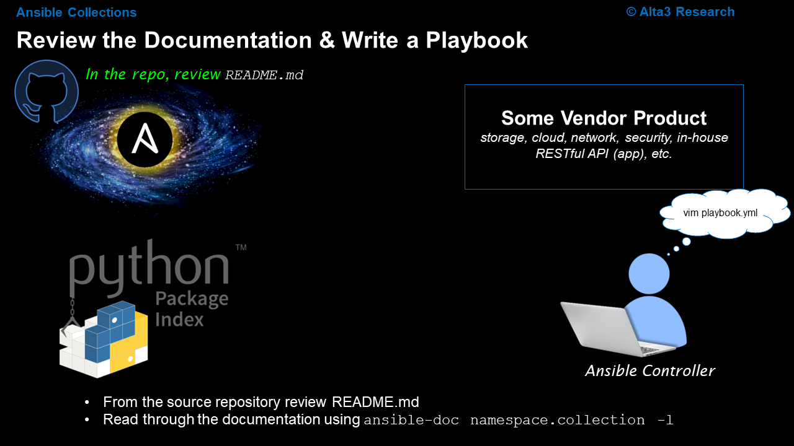
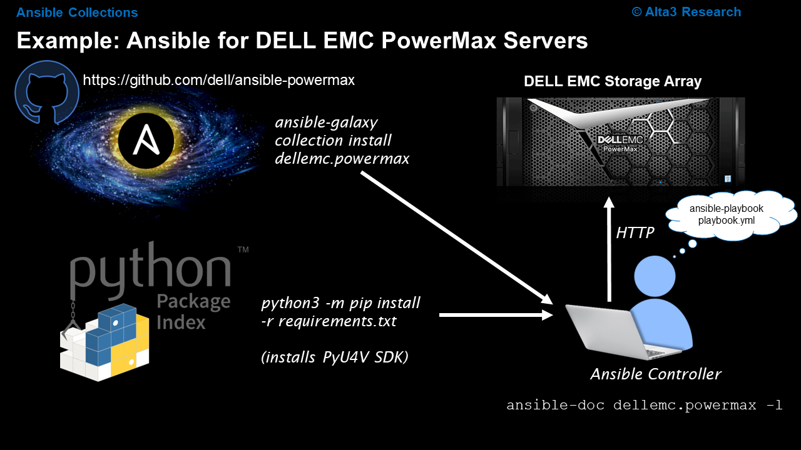
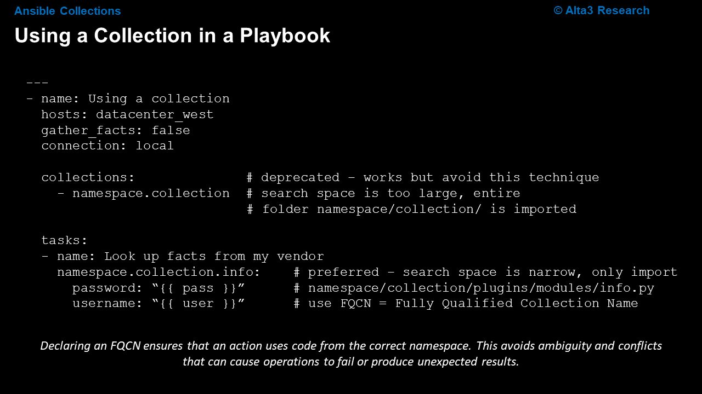
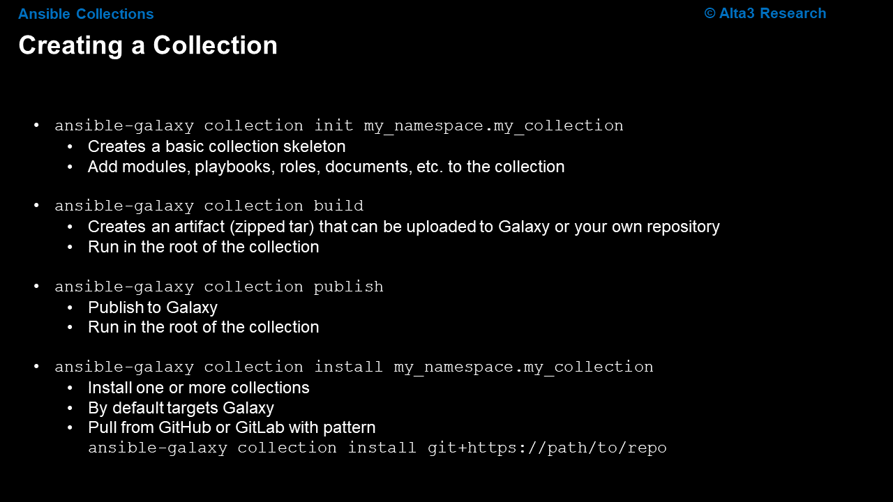

# Collections, Roles, and Ansible Galaxy
Collections are a distribution format (zipped tar file) for Ansible content that can include playbooks, roles, modules, and plugins. You can install and use collections through a distribution server, such as Ansible Galaxy, or directly from an SCM like GitHub or GitLab.

Resources:

[Installing Collections](https://docs.ansible.com/ansible/latest/collections_guide/collections_installing.html)

[Ansible Galaxy](https://galaxy.ansible.com/ui/)

## Slides

